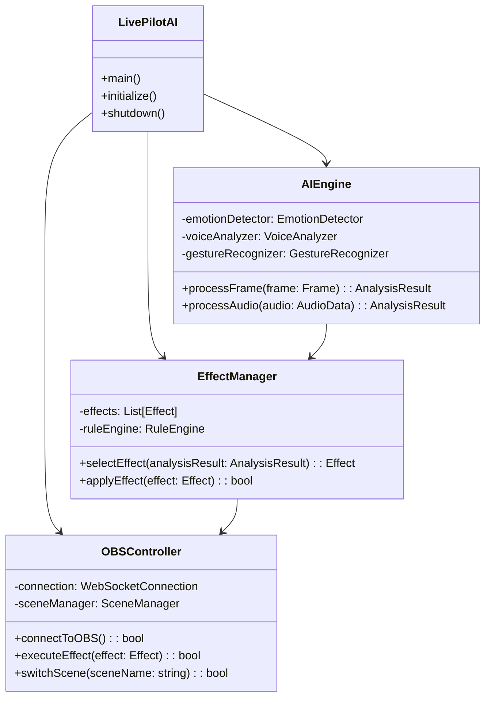
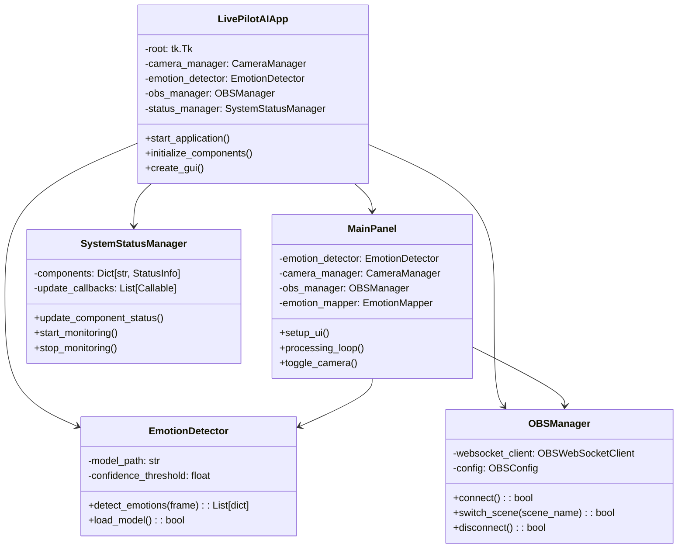

# 🏗️ LivePilotAI 類別圖設計對比分析

**分析日期**: 2025年6月13日  
**目的**: 對比原始UML設計與實際實作的類別結構

---

## 📐 **原始 UML 類別圖設計**

### 🎯 **理想架構設計 (規劃階段)**



### 📋 **規劃的詳細類別**

#### **AI引擎模組**
```python
class AIEngine:
    def __init__(self):
        self.emotion_detector = EmotionDetector()
        self.voice_analyzer = VoiceAnalyzer()      # 未實作
        self.gesture_recognizer = GestureRecognizer()  # 未實作
        self.frame_processor = FrameProcessor()
        
class EmotionDetector:
    def __init__(self, model_path: str):
        self.model = None
        self.confidence_threshold = 0.7
        self.face_cascade = cv2.CascadeClassifier()
        
class VoiceAnalyzer:  # 計劃中的類別
    def __init__(self):
        self.audio_processor = AudioProcessor()
        self.pitch_analyzer = PitchAnalyzer()
        
class GestureRecognizer:  # 計劃中的類別
    def __init__(self):
        self.mediapipe_hands = mp.solutions.hands
        self.gesture_classifier = GestureClassifier()
```

#### **OBS整合模組**
```python
class OBSController:  # 原始設計名稱
    def __init__(self, host: str, port: int):
        self.connection = WebSocketConnection()
        self.scene_manager = SceneManager()
        self.effect_processor = EffectProcessor()

class EffectManager:  # 原始設計
    def __init__(self):
        self.effects = []
        self.rule_engine = RuleEngine()
        self.mapping_config = MappingConfig()
```

---

## 🏭 **實際實作類別結構**

### 🔧 **當前架構實作 (v1.0.0)**



### 📝 **實際實作的主要類別**

#### **1. 主應用程式類別**
```python
class LivePilotAIApp:
    """主應用程式控制器"""
    def __init__(self):
        self.root = None  # tkinter 根窗口
        self.camera_manager = None
        self.emotion_detector = None
        self.obs_manager = None
        self.status_manager = None
        self.settings = self._load_default_settings()
        
    def start_application(self):
        """啟動應用程式的主要流程"""
        self.load_settings()
        self.create_gui()
        self.initialize_components()
        # ... 自動啟動邏輯
        self.root.mainloop()
```

#### **2. UI主面板類別**
```python
class MainPanel:
    """主控制面板 - 獨立的UI組件"""
    def __init__(self, config: Optional[PanelConfig] = None):
        self.emotion_detector = None
        self.camera_manager = None
        self.obs_manager = None
        self.emotion_mapper = None
        
    def setup_ui(self):
        """設置完整的用戶界面"""
        self._create_main_layout()
        self._create_control_panel()
        self._create_preview_area()
        # ... UI 組件創建
```

#### **3. AI引擎實作**
```python
class EmotionDetector:
    """情緒檢測引擎"""
    def __init__(self):
        self.model = None
        self.face_detector = None
        self.emotion_labels = ['angry', 'disgust', 'fear', 'happy', 'neutral', 'sad', 'surprise']
        
    def detect_emotions(self, frame) -> List[Dict[str, Any]]:
        """檢測圖像中的情緒"""
        # 實際的情緒檢測邏輯
        
class CameraManager:
    """攝像頭管理器"""
    def __init__(self):
        self.camera = None
        self.is_running = False
        
    def start_camera(self, camera_index: int = 0) -> bool:
        """啟動攝像頭"""
        
class RealTimeEmotionDetector:
    """即時情緒檢測器"""
    @dataclass
    class RealTimeConfig:
        camera_config: CameraConfig = field(default_factory=CameraConfig)
        detection_config: DetectionConfig = field(default_factory=DetectionConfig)
```

#### **4. OBS整合實作**
```python
class OBSManager:
    """OBS Studio 管理器"""
    def __init__(self, config: Optional[OBSConfig] = None):
        self.config = config or OBSConfig()
        self.websocket_client = None
        self.is_connected = False
        
    async def connect(self) -> bool:
        """連接到 OBS Studio"""
        
class OBSWebSocketClient:
    """OBS WebSocket 客戶端"""
    def __init__(self, host: str, port: int, password: str = ""):
        self.host = host
        self.port = port
        self.password = password
        
class EmotionMapper:
    """情緒映射器"""
    def __init__(self):
        self.emotion_scene_mapping = {}
        self.switch_cooldown = 2.0
```

#### **5. 狀態管理實作**
```python
class SystemStatusManager:
    """系統狀態管理器"""
    def __init__(self, update_callback: Optional[Callable] = None):
        self.components = {}
        self.update_callback = update_callback
        
    def update_component_status(self, panel: str, component: str, level, message: str):
        """更新組件狀態"""
        
class StatusIndicator:
    """狀態指示器UI組件"""
    def __init__(self, parent, component_name: str):
        self.component_name = component_name
        self.status_level = StatusLevel.OFFLINE
```

---

## 📊 **設計對比分析**

### 🎯 **架構理念對比**

| 設計層面 | 原始規劃 | 實際實作 | 變更原因 |
|----------|----------|----------|----------|
| **主控制器** | `LivePilotAI` 單一入口 | `LivePilotAIApp` + `MainPanel` 分離 | UI與邏輯分離，更好的模組化 |
| **AI引擎** | `AIEngine` 統一管理 | 各個檢測器獨立 | 簡化依賴，提高靈活性 |
| **OBS控制** | `OBSController` + `EffectManager` | `OBSManager` + `EmotionMapper` | 功能整合，減少複雜度 |
| **效果系統** | 獨立的 `EffectManager` | 整合到 `EmotionMapper` | 簡化架構，專注核心功能 |

### 🔄 **類別關係變化**

#### **規劃的關係 (複雜但全面)**
```
LivePilotAI (入口)
├── AIEngine (AI統一管理)
│   ├── EmotionDetector
│   ├── VoiceAnalyzer
│   └── GestureRecognizer
├── OBSController (OBS控制)
├── EffectManager (效果管理)
└── RuleEngine (規則引擎)
```

#### **實作的關係 (簡化但實用)**
```
LivePilotAIApp (主應用程式)
├── MainPanel (UI控制器)
│   ├── EmotionDetector
│   ├── CameraManager
│   └── OBSManager
├── SystemStatusManager (狀態管理)
└── ConfigurationManager (配置管理)
```

### 📈 **優化決策分析**

#### **✅ 成功的簡化**
1. **UI分離**: MainPanel 獨立於主應用程式邏輯
2. **直接集成**: 減少中間抽象層，提高性能
3. **狀態管理**: 統一的狀態監控系統
4. **配置驅動**: JSON配置替代複雜的規則引擎

#### **⚠️ 需要考慮的權衡**
1. **可擴展性**: 簡化後的架構可能限制未來擴展
2. **測試性**: 直接依賴可能影響單元測試
3. **重用性**: 某些組件耦合度較高
4. **複雜性**: 隨著功能增加，可能需要重構

---

## 🚀 **設計模式應用分析**

### 📐 **當前使用的設計模式**

#### **1. 單例模式 (Singleton)**
```python
class SystemStatusManager:
    _instance = None
    
    def __new__(cls, *args, **kwargs):
        if not cls._instance:
            cls._instance = super().__new__(cls)
        return cls._instance
```
**用途**: 確保狀態管理器的唯一性

#### **2. 觀察者模式 (Observer)**
```python
class SystemStatusManager:
    def __init__(self, update_callback: Optional[Callable] = None):
        self.update_callback = update_callback
        
    def update_component_status(self, panel, component, level, message):
        # 更新狀態
        if self.update_callback:
            self.update_callback(panel, component, level, message)
```
**用途**: 狀態變化通知機制

#### **3. 工廠模式 (Factory)**
```python
def create_obs_status_panel(parent, status_manager):
    """工廠函數創建OBS狀態面板"""
    return StatusPanel(parent, "obs", status_manager)

def create_ai_status_panel(parent, status_manager):
    """工廠函數創建AI狀態面板"""
    return StatusPanel(parent, "ai_engine", status_manager)
```
**用途**: UI組件的標準化創建

#### **4. 策略模式 (Strategy)**
```python
class EmotionMapper:
    def __init__(self):
        self.mapping_strategies = {
            'simple': self._simple_mapping,
            'advanced': self._advanced_mapping,
            'custom': self._custom_mapping
        }
    
    def map_emotion_to_scene(self, emotion, strategy='simple'):
        mapper = self.mapping_strategies.get(strategy)
        return mapper(emotion) if mapper else None
```
**用途**: 不同的情緒映射策略

### 🎯 **建議增加的設計模式**

#### **1. 命令模式 (Command)**
```python
class OBSCommand:
    """OBS操作命令的抽象基類"""
    def execute(self):
        raise NotImplementedError
    
    def undo(self):
        raise NotImplementedError

class SwitchSceneCommand(OBSCommand):
    def __init__(self, obs_manager, scene_name):
        self.obs_manager = obs_manager
        self.scene_name = scene_name
        self.previous_scene = None
        
    def execute(self):
        self.previous_scene = self.obs_manager.current_scene
        return self.obs_manager.switch_scene(self.scene_name)
        
    def undo(self):
        if self.previous_scene:
            return self.obs_manager.switch_scene(self.previous_scene)
```
**優點**: 操作的撤銷/重做，操作隊列管理

#### **2. 代理模式 (Proxy)**
```python
class CacheProxy:
    """快取代理，用於緩存昂貴的AI推理結果"""
    def __init__(self, emotion_detector):
        self.emotion_detector = emotion_detector
        self.cache = {}
        
    def detect_emotions(self, frame):
        frame_hash = self._hash_frame(frame)
        if frame_hash in self.cache:
            return self.cache[frame_hash]
            
        result = self.emotion_detector.detect_emotions(frame)
        self.cache[frame_hash] = result
        return result
```
**優點**: 性能優化，網絡代理，權限控制

#### **3. 裝飾器模式 (Decorator)**
```python
class PerformanceMonitorDecorator:
    """性能監控裝飾器"""
    def __init__(self, component):
        self.component = component
        
    def detect_emotions(self, frame):
        start_time = time.time()
        result = self.component.detect_emotions(frame)
        end_time = time.time()
        
        # 記錄性能指標
        self._log_performance(end_time - start_time)
        return result
```
**優點**: 橫切關注點（日誌、性能監控、緩存）

#### **4. 建造者模式 (Builder)**
```python
class ConfigurationBuilder:
    """配置建造者"""
    def __init__(self):
        self.config = {}
        
    def set_camera_config(self, camera_config):
        self.config['camera'] = camera_config
        return self
        
    def set_obs_config(self, obs_config):
        self.config['obs'] = obs_config
        return self
        
    def set_ai_config(self, ai_config):
        self.config['ai'] = ai_config
        return self
        
    def build(self):
        return ApplicationConfig(self.config)
```
**優點**: 複雜配置的逐步構建

---

## 📋 **程式碼品質評估**

### 🎯 **SOLID 原則遵循度**

#### **S - 單一職責原則 (Single Responsibility)**
- ✅ **良好**: `EmotionDetector` 只負責情緒檢測
- ✅ **良好**: `CameraManager` 只負責攝像頭管理
- ⚠️ **需改進**: `LivePilotAIApp` 職責較多，可以進一步分解

#### **O - 開放封閉原則 (Open/Closed)**
- ✅ **良好**: `StatusIndicator` 可以擴展新的狀態類型
- ⚠️ **需改進**: `EmotionMapper` 添加新映射策略需要修改代碼

#### **L - 里氏替換原則 (Liskov Substitution)**
- ✅ **良好**: 各個管理器都有清晰的介面
- ⚠️ **需改進**: 缺乏抽象基類，影響替換性

#### **I - 介面隔離原則 (Interface Segregation)**
- ✅ **良好**: UI組件介面分離良好
- ⚠️ **需改進**: 某些類別介面較大，可以進一步分離

#### **D - 依賴反轉原則 (Dependency Inversion)**
- ⚠️ **需改進**: 大部分類別直接依賴具體實作，而非抽象

### 🔧 **重構建議**

#### **1. 引入抽象介面**
```python
from abc import ABC, abstractmethod

class EmotionDetectorInterface(ABC):
    @abstractmethod
    def detect_emotions(self, frame) -> List[Dict[str, Any]]:
        pass

class OBSManagerInterface(ABC):
    @abstractmethod
    async def connect(self) -> bool:
        pass
        
    @abstractmethod
    async def switch_scene(self, scene_name: str) -> bool:
        pass
```

#### **2. 依賴注入容器**
```python
class DIContainer:
    def __init__(self):
        self._services = {}
        
    def register(self, interface, implementation):
        self._services[interface] = implementation
        
    def resolve(self, interface):
        return self._services.get(interface)

# 使用示例
container = DIContainer()
container.register(EmotionDetectorInterface, EmotionDetector)
container.register(OBSManagerInterface, OBSManager)
```

#### **3. 事件驅動架構**
```python
class EventBus:
    def __init__(self):
        self._handlers = {}
        
    def subscribe(self, event_type, handler):
        if event_type not in self._handlers:
            self._handlers[event_type] = []
        self._handlers[event_type].append(handler)
        
    def publish(self, event_type, data):
        handlers = self._handlers.get(event_type, [])
        for handler in handlers:
            handler(data)

# 事件定義
@dataclass
class EmotionDetectedEvent:
    emotion: str
    confidence: float
    timestamp: float
```

---

## 🏆 **總結與建議**

### 📊 **整體評估**

| 評估項目 | 評分 | 說明 |
|----------|------|------|
| **架構清晰度** | A- | 結構清晰，但缺乏抽象層 |
| **模組化程度** | B+ | 模組分離良好，耦合度適中 |
| **可擴展性** | B | 基本可擴展，但需要重構支持 |
| **可測試性** | C+ | 直接依賴影響單元測試 |
| **可維護性** | B+ | 代碼結構清晰，易於理解 |
| **性能考量** | A- | 直接調用性能好，但缺乏優化 |

### 🎯 **核心優勢**
1. **實用主義**: 專注解決實際問題，避免過度設計
2. **快速開發**: 簡化的架構支持快速迭代
3. **功能完整**: 核心功能實作完整且穩定
4. **用戶友好**: UI設計直觀，用戶體驗良好

### ⚡ **改進方向**
1. **抽象化**: 引入適當的抽象層和介面
2. **測試友好**: 重構以支持更好的單元測試
3. **可配置性**: 增加更多配置選項和策略
4. **監控增強**: 加強性能監控和診斷功能

### 🚀 **演進路徑**
1. **Phase 1**: 保持當前架構，補充測試和文檔
2. **Phase 2**: 引入抽象介面，改善依賴關係
3. **Phase 3**: 重構為插件化架構，支持擴展
4. **Phase 4**: 微服務架構，支持分散式部署

---

**分析完成**: 2025年6月13日  
**下次檢討**: 重大重構或版本發布後  
**建議優先級**: 中高（建議在v2.0.0版本中實施部分改進）
