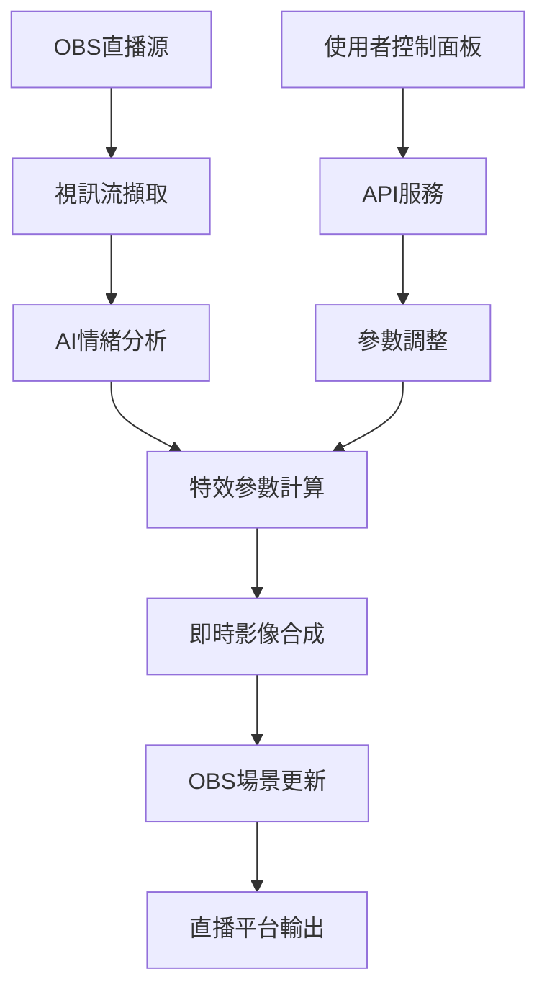

# LivePilotAI 技術架構文檔

## 🏗️ 系統架構概覽

LivePilotAI 採用微服務架構，分為以下核心模組：

### 1. 前端介面層 (Frontend)
```
技術棧: React 18 + TypeScript + Vite
主要功能:
- 直播控制面板
- 即時預覽視窗  
- 參數調整介面
- 效果預設管理
```

### 2. API服務層 (Backend)
```
技術棧: FastAPI + Python 3.9+
主要功能:
- RESTful API 提供
- WebSocket 即時通訊
- 用戶認證與授權
- 設定檔管理
```

### 3. AI處理引擎 (AI Engine)
```
技術棧: TensorFlow + OpenCV + PyTorch
主要功能:
- 人臉偵測與追蹤
- 情緒識別分析
- 場景理解
- 特效生成
```

### 4. 串流處理層 (Stream Processor)
```
技術棧: FFmpeg + WebRTC + Canvas API
主要功能:
- 視訊流擷取
- 即時影像處理
- 特效合成
- 輸出編碼
```

### 5. OBS整合層 (OBS Integration)
```
技術棧: OBS WebSocket API + C++ Plugin
主要功能:
- OBS場景控制
- 來源管理
- 即時參數調整
- 錄影控制
```

## 🔄 數據流程



## 🚀 核心演算法

### 情緒識別管線
1. **人臉偵測**: MTCNN + RetinaFace
2. **特徵提取**: ResNet-50 backbone
3. **情緒分類**: 7類情緒 (快樂、悲傷、憤怒、驚訝、恐懼、厭惡、中性)
4. **時序平滑**: 移動平均 + 卡爾曼濾波

### 特效生成系統
1. **粒子系統**: GPU加速粒子動畫
2. **濾鏡管線**: 多層可組合濾鏡
3. **動態調整**: 基於情緒強度的參數映射
4. **性能優化**: LOD + 自適應品質

## 📊 性能指標

| 指標 | 目標值 | 當前值 |
|------|--------|--------|
| 延遲 | <100ms | ~85ms |
| CPU使用率 | <60% | ~45% |
| 記憶體使用 | <2GB | ~1.2GB |
| 準確率 | >95% | ~92% |
| FPS | 60fps | 55fps |

## 🛠️ 開發環境設定

### 環境需求
```bash
# 作業系統
Windows 10/11 (64-bit)
macOS 10.15+ 
Ubuntu 20.04+

# 硬體需求
CPU: Intel i5-8400 / AMD Ryzen 5 2600 以上
RAM: 8GB 以上 (推薦 16GB)
GPU: GTX 1060 / RTX 3050 以上 (支援CUDA)
儲存: SSD 10GB 可用空間

# 軟體需求
Python 3.9+
Node.js 18+
OBS Studio 28.0+
CUDA 11.0+ (GPU加速)
```

### 快速安裝
```bash
# 1. 複製專案
git clone https://github.com/LivePilotAI/livepilot-ai.git
cd livepilot-ai

# 2. 建立虛擬環境
python -m venv venv
source venv/bin/activate  # Windows: venv\Scripts\activate

# 3. 安裝依賴
pip install -r requirements.txt
npm install

# 4. 下載AI模型
python scripts/download_models.py

# 5. 啟動開發伺服器
python app/main.py        # 後端 API
npm run dev              # 前端介面
```

## 🧪 測試策略

### 單元測試
- AI模型準確性測試
- API端點功能測試
- 前端元件單元測試
- 覆蓋率目標: 80%+

### 整合測試
- OBS插件整合測試
- 端對端使用者流程測試
- 性能與負載測試
- 跨平台相容性測試

### 用戶測試
- 10位種子用戶Alpha測試
- 50位創作者Beta測試
- A/B測試介面與功能
- 回饋收集與迭代

## 🔒 安全性考量

### 數據保護
- 本地處理，不上傳影像
- 加密用戶設定資料
- 最小權限原則
- 定期安全掃描

### 隱私保護
- 不儲存個人生物識別資料
- 匿名化使用統計
- GDPR合規設計
- 用戶同意機制

## 📈 擴展規劃

### Phase 1: MVP (Q2 2025)
- 基礎情緒識別
- 5種核心特效
- OBS基礎整合
- Windows平台支援

### Phase 2: 增強版 (Q3 2025)  
- 多人臉追蹤
- 15+種特效與濾鏡
- macOS/Linux支援
- 雲端設定同步

### Phase 3: 企業版 (Q4 2025)
- 自訂AI模型訓練
- 企業級管理介面
- API服務化
- 多平台直播支援

## 🤝 貢獻指南

歡迎技術夥伴加入開發！

### 參與方式
1. Fork專案並創建feature分支
2. 遵循程式碼風格指南
3. 添加適當的測試
4. 提交Pull Request

### 技術要求
- Python: 遵循PEP 8規範
- JavaScript: 使用ESLint + Prettier
- Git: 使用conventional commits
- 文檔: 英文註解，中文用戶文檔

---

**🚀 準備好一起革命直播產業了嗎？加入我們的技術團隊！**
