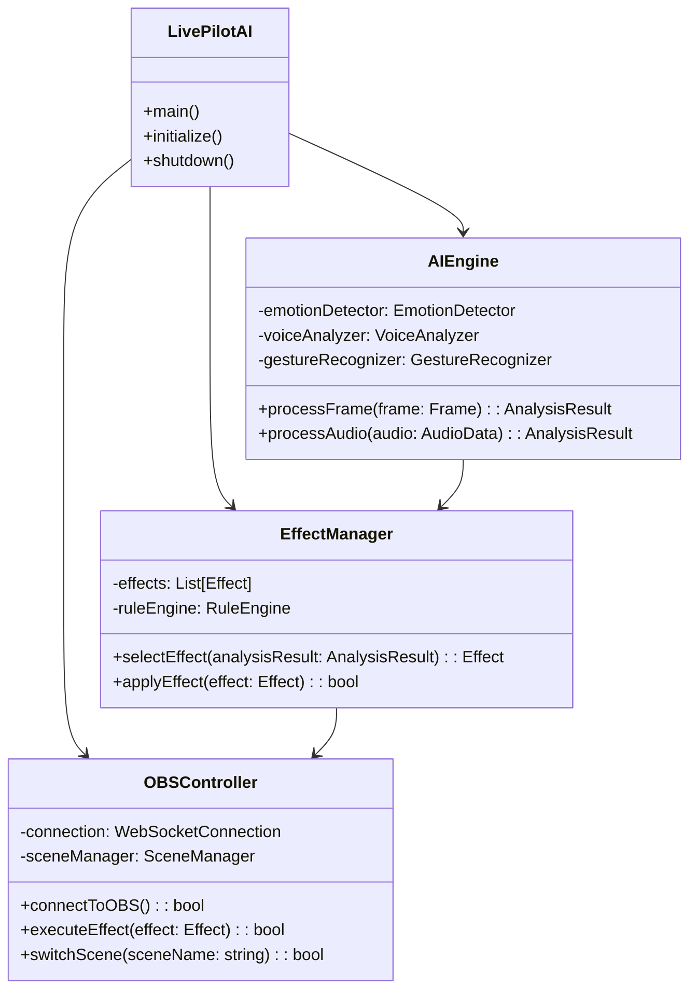

# LivePilotAI UML類別圖設計

## 1. 核心類別架構概覽

### 1.1 主要模組類別關係



## 2. AI引擎模組類別設計

### 2.1 AI引擎核心類別

```python
class AIEngine:
    """AI引擎核心類別，負責協調所有AI分析功能"""
    
    def __init__(self):
        self.emotion_detector = EmotionDetector()
        self.voice_analyzer = VoiceAnalyzer()
        self.gesture_recognizer = GestureRecognizer()
        self.frame_processor = FrameProcessor()
        self.is_running = False
    
    def start_analysis(self) -> bool:
        """啟動AI分析引擎"""
        pass
    
    def stop_analysis(self) -> bool:
        """停止AI分析引擎"""
        pass
    
    def process_frame(self, frame: np.ndarray) -> AnalysisResult:
        """處理影像幀"""
        pass
    
    def process_audio(self, audio_data: np.ndarray) -> AnalysisResult:
        """處理音訊資料"""
        pass
    
    def get_performance_metrics(self) -> Dict:
        """取得效能指標"""
        pass

class EmotionDetector:
    """情緒檢測類別"""
    
    def __init__(self, model_path: str = "models/emotion_model.h5"):
        self.model = None
        self.model_path = model_path
        self.confidence_threshold = 0.7
        self.face_cascade = cv2.CascadeClassifier()
    
    def load_model(self) -> bool:
        """載入情緒檢測模型"""
        pass
    
    def detect_faces(self, frame: np.ndarray) -> List[Tuple]:
        """檢測人臉位置"""
        pass
    
    def analyze_emotion(self, face_region: np.ndarray) -> EmotionResult:
        """分析情緒"""
        pass
    
    def preprocess_face(self, face_image: np.ndarray) -> np.ndarray:
        """預處理人臉圖像"""
        pass

class VoiceAnalyzer:
    """語音分析類別"""
    
    def __init__(self):
        self.sample_rate = 16000
        self.frame_length = 2048
        self.hop_length = 512
        self.is_initialized = False
    
    def initialize(self) -> bool:
        """初始化語音分析器"""
        pass
    
    def analyze_tone(self, audio_data: np.ndarray) -> ToneResult:
        """分析語調"""
        pass
    
    def extract_features(self, audio_data: np.ndarray) -> Dict:
        """提取音訊特徵"""
        pass
    
    def detect_volume_change(self, audio_data: np.ndarray) -> VolumeResult:
        """檢測音量變化"""
        pass

class GestureRecognizer:
    """手勢識別類別"""
    
    def __init__(self):
        self.mediapipe_hands = None
        self.mediapipe_pose = None
        self.gesture_classifier = None
    
    def initialize_mediapipe(self) -> bool:
        """初始化MediaPipe"""
        pass
    
    def detect_hand_landmarks(self, frame: np.ndarray) -> List[HandLandmarks]:
        """檢測手部關鍵點"""
        pass
    
    def detect_pose_landmarks(self, frame: np.ndarray) -> PoseLandmarks:
        """檢測姿態關鍵點"""
        pass
    
    def classify_gesture(self, landmarks: HandLandmarks) -> GestureResult:
        """分類手勢"""
        pass
```

### 2.2 資料模型類別

```python
@dataclass
class AnalysisResult:
    """分析結果資料類別"""
    timestamp: datetime
    emotion_result: EmotionResult
    voice_result: VoiceResult
    gesture_result: GestureResult
    confidence_score: float
    
    def to_dict(self) -> Dict:
        """轉換為字典格式"""
        pass
    
    def is_valid(self) -> bool:
        """驗證結果有效性"""
        pass

@dataclass
class EmotionResult:
    """情緒檢測結果"""
    emotion: str  # 'happy', 'sad', 'angry', 'surprised', 'neutral'
    confidence: float
    face_coordinates: Tuple[int, int, int, int]
    intensity: float  # 0.0 to 1.0
    
@dataclass
class VoiceResult:
    """語音分析結果"""
    tone: str  # 'excited', 'calm', 'tense', 'neutral'
    volume_level: float
    pitch_change: float
    energy_level: float

@dataclass
class GestureResult:
    """手勢識別結果"""
    gesture_type: str  # 'wave', 'thumbs_up', 'peace', 'none'
    confidence: float
    hand_position: Tuple[float, float]
    gesture_direction: str  # 'up', 'down', 'left', 'right'
```

## 3. OBS整合模組類別設計

### 3.1 OBS控制器類別

```python
class OBSController:
    """OBS控制器，負責與OBS Studio通訊"""
    
    def __init__(self, host: str = "localhost", port: int = 4444):
        self.host = host
        self.port = port
        self.websocket = None
        self.scene_manager = SceneManager()
        self.source_manager = SourceManager()
        self.is_connected = False
    
    def connect(self, password: str = "") -> bool:
        """連接到OBS WebSocket"""
        pass
    
    def disconnect(self) -> bool:
        """斷開OBS連接"""
        pass
    
    def send_command(self, command: Dict) -> Dict:
        """發送命令到OBS"""
        pass
    
    def get_scenes(self) -> List[str]:
        """取得場景列表"""
        pass
    
    def switch_scene(self, scene_name: str) -> bool:
        """切換場景"""
        pass

class SceneManager:
    """場景管理器"""
    
    def __init__(self):
        self.current_scene = ""
        self.scene_list = []
        self.scene_configs = {}
    
    def load_scene_configs(self, config_path: str) -> bool:
        """載入場景配置"""
        pass
    
    def create_scene(self, scene_name: str, config: Dict) -> bool:
        """創建新場景"""
        pass
    
    def delete_scene(self, scene_name: str) -> bool:
        """刪除場景"""
        pass
    
    def get_scene_sources(self, scene_name: str) -> List[str]:
        """取得場景中的來源"""
        pass

class SourceManager:
    """來源管理器"""
    
    def __init__(self):
        self.sources = {}
        self.source_types = ['camera', 'overlay', 'text', 'image', 'video']
    
    def add_source(self, source_name: str, source_type: str, settings: Dict) -> bool:
        """添加來源"""
        pass
    
    def remove_source(self, source_name: str) -> bool:
        """移除來源"""
        pass
    
    def update_source_settings(self, source_name: str, settings: Dict) -> bool:
        """更新來源設定"""
        pass
    
    def toggle_source_visibility(self, source_name: str) -> bool:
        """切換來源可見性"""
        pass
```

## 4. 特效管理模組類別設計

### 4.1 特效管理器類別

```python
class EffectManager:
    """特效管理器，負責選擇和應用特效"""
    
    def __init__(self):
        self.effects_registry = EffectsRegistry()
        self.rule_engine = RuleEngine()
        self.effect_queue = Queue()
        self.current_effect = None
    
    def register_effect(self, effect: Effect) -> bool:
        """註冊新特效"""
        pass
    
    def select_effect(self, analysis_result: AnalysisResult) -> Effect:
        """根據分析結果選擇特效"""
        pass
    
    def apply_effect(self, effect: Effect) -> bool:
        """應用特效"""
        pass
    
    def queue_effect(self, effect: Effect, delay: float = 0) -> bool:
        """將特效加入佇列"""
        pass

class Effect:
    """特效基礎類別"""
    
    def __init__(self, name: str, effect_type: str):
        self.name = name
        self.effect_type = effect_type  # 'visual', 'audio', 'scene_switch'
        self.duration = 0.0
        self.priority = 1
        self.is_active = False
    
    def execute(self, obs_controller: OBSController) -> bool:
        """執行特效（抽象方法）"""
        raise NotImplementedError
    
    def validate(self) -> bool:
        """驗證特效參數"""
        pass

class VisualEffect(Effect):
    """視覺特效類別"""
    
    def __init__(self, name: str, overlay_path: str, animation_type: str):
        super().__init__(name, 'visual')
        self.overlay_path = overlay_path
        self.animation_type = animation_type  # 'fade', 'slide', 'bounce'
        self.position = (0, 0)
        self.scale = 1.0
    
    def execute(self, obs_controller: OBSController) -> bool:
        """執行視覺特效"""
        pass

class AudioEffect(Effect):
    """音效特效類別"""
    
    def __init__(self, name: str, audio_file: str):
        super().__init__(name, 'audio')
        self.audio_file = audio_file
        self.volume = 1.0
        self.loop = False
    
    def execute(self, obs_controller: OBSController) -> bool:
        """執行音效"""
        pass

class SceneSwitchEffect(Effect):
    """場景切換特效類別"""
    
    def __init__(self, name: str, target_scene: str, transition_type: str):
        super().__init__(name, 'scene_switch')
        self.target_scene = target_scene
        self.transition_type = transition_type  # 'cut', 'fade', 'slide'
        self.transition_duration = 1000  # milliseconds
    
    def execute(self, obs_controller: OBSController) -> bool:
        """執行場景切換"""
        pass
```

### 4.2 規則引擎類別

```python
class RuleEngine:
    """規則引擎，根據AI分析結果決定觸發的特效"""
    
    def __init__(self):
        self.rules = []
        self.rule_cache = {}
        self.default_effect = None
    
    def add_rule(self, rule: EffectRule) -> bool:
        """添加規則"""
        pass
    
    def remove_rule(self, rule_id: str) -> bool:
        """移除規則"""
        pass
    
    def evaluate_rules(self, analysis_result: AnalysisResult) -> Effect:
        """評估規則並選擇特效"""
        pass
    
    def load_rules_from_config(self, config_path: str) -> bool:
        """從配置文件載入規則"""
        pass

class EffectRule:
    """特效規則類別"""
    
    def __init__(self, rule_id: str, name: str):
        self.rule_id = rule_id
        self.name = name
        self.conditions = []
        self.target_effect = None
        self.priority = 1
        self.is_enabled = True
    
    def add_condition(self, condition: RuleCondition) -> bool:
        """添加條件"""
        pass
    
    def evaluate(self, analysis_result: AnalysisResult) -> bool:
        """評估規則是否匹配"""
        pass

class RuleCondition:
    """規則條件類別"""
    
    def __init__(self, field: str, operator: str, value: Any):
        self.field = field  # 'emotion', 'voice_tone', 'gesture'
        self.operator = operator  # '==', '>', '<', 'in', 'contains'
        self.value = value
    
    def check(self, analysis_result: AnalysisResult) -> bool:
        """檢查條件是否滿足"""
        pass
```

## 5. 配置管理類別設計

### 5.1 配置管理器

```python
class ConfigManager:
    """配置管理器"""
    
    def __init__(self, config_dir: str = "config"):
        self.config_dir = config_dir
        self.user_config = UserConfig()
        self.system_config = SystemConfig()
        self.effect_config = EffectConfig()
    
    def load_all_configs(self) -> bool:
        """載入所有配置"""
        pass
    
    def save_all_configs(self) -> bool:
        """保存所有配置"""
        pass
    
    def reset_to_defaults(self) -> bool:
        """重設為預設值"""
        pass

class UserConfig:
    """使用者配置類別"""
    
    def __init__(self):
        self.obs_connection = {
            'host': 'localhost',
            'port': 4444,
            'password': ''
        }
        self.ai_settings = {
            'emotion_sensitivity': 0.7,
            'voice_sensitivity': 0.6,
            'gesture_sensitivity': 0.8
        }
        self.ui_preferences = {
            'theme': 'dark',
            'language': 'zh-TW',
            'notifications': True
        }
    
    def update_setting(self, section: str, key: str, value: Any) -> bool:
        """更新設定值"""
        pass
    
    def validate_settings(self) -> bool:
        """驗證設定有效性"""
        pass

class SystemConfig:
    """系統配置類別"""
    
    def __init__(self):
        self.performance = {
            'max_fps': 30,
            'gpu_acceleration': True,
            'memory_limit_mb': 1024
        }
        self.logging = {
            'level': 'INFO',
            'file_path': 'logs/livepilot.log',
            'max_size_mb': 100
        }
    
    def get_resource_limits(self) -> Dict:
        """取得資源限制"""
        pass
```

## 6. 使用者介面類別設計

### 6.1 主要UI控制器

```python
class MainController:
    """主控制器，協調所有UI元件"""
    
    def __init__(self):
        self.ai_engine = AIEngine()
        self.obs_controller = OBSController()
        self.effect_manager = EffectManager()
        self.config_manager = ConfigManager()
        self.ui_state = UIState()
    
    def initialize_application(self) -> bool:
        """初始化應用程式"""
        pass
    
    def start_live_analysis(self) -> bool:
        """開始即時分析"""
        pass
    
    def stop_live_analysis(self) -> bool:
        """停止即時分析"""
        pass
    
    def handle_user_action(self, action: str, params: Dict) -> bool:
        """處理使用者動作"""
        pass

class UIState:
    """UI狀態管理"""
    
    def __init__(self):
        self.is_connected_to_obs = False
        self.is_ai_running = False
        self.current_emotion = "neutral"
        self.current_effect = None
        self.performance_stats = {}
    
    def update_state(self, key: str, value: Any) -> None:
        """更新狀態"""
        pass
    
    def get_state_dict(self) -> Dict:
        """取得完整狀態字典"""
        pass
```

## 7. 類別關係總結

### 7.1 繼承關係
- `Effect` ← `VisualEffect`, `AudioEffect`, `SceneSwitchEffect`
- `BaseConfig` ← `UserConfig`, `SystemConfig`, `EffectConfig`

### 7.2 組合關係
- `LivePilotAI` 包含 `AIEngine`, `OBSController`, `EffectManager`
- `AIEngine` 包含 `EmotionDetector`, `VoiceAnalyzer`, `GestureRecognizer`
- `EffectManager` 包含 `RuleEngine`, `EffectsRegistry`

### 7.3 依賴關係
- `EffectManager` 依賴 `OBSController` 來執行特效
- `RuleEngine` 依賴 `AnalysisResult` 來評估規則
- 所有模組都依賴 `ConfigManager` 來取得配置

---

**文件版本:** 1.0  
**最後更新:** 2025-05-31  
**負責人:** LivePilotAI 開發團隊